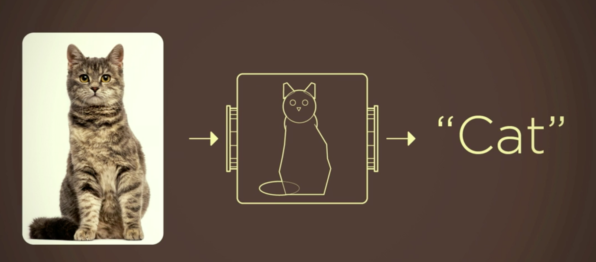
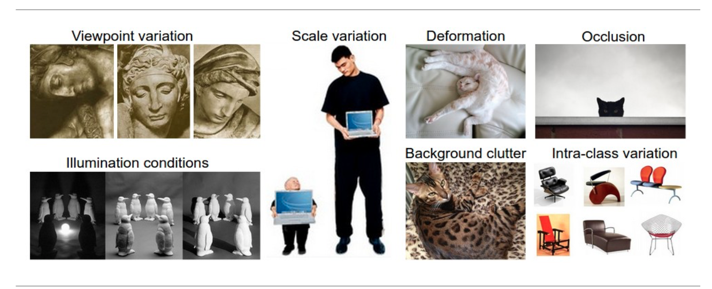
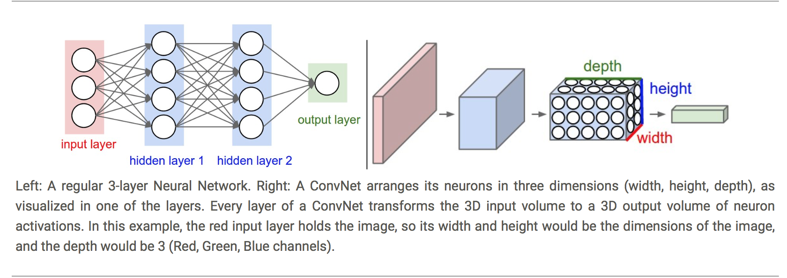
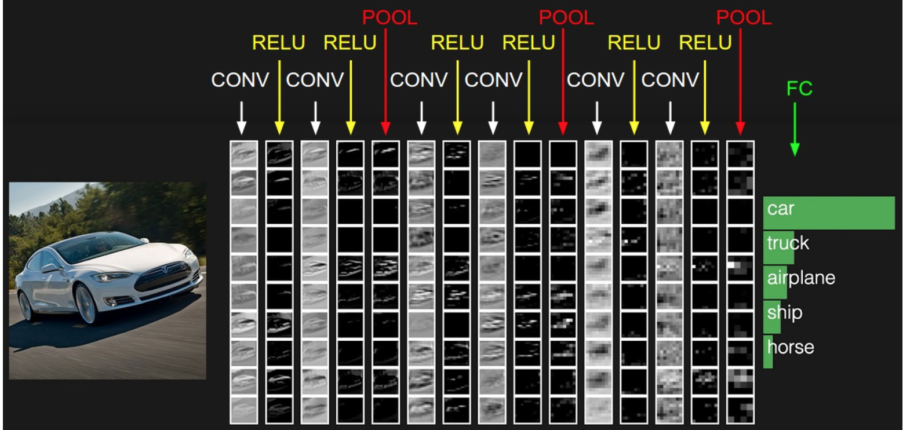
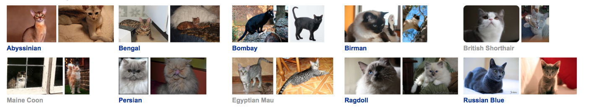
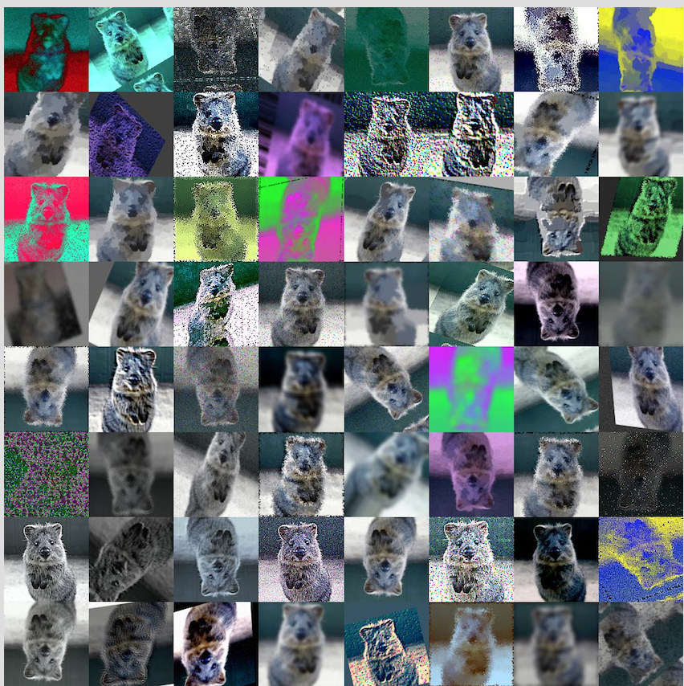
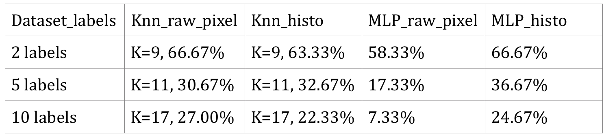
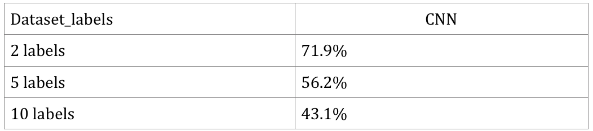
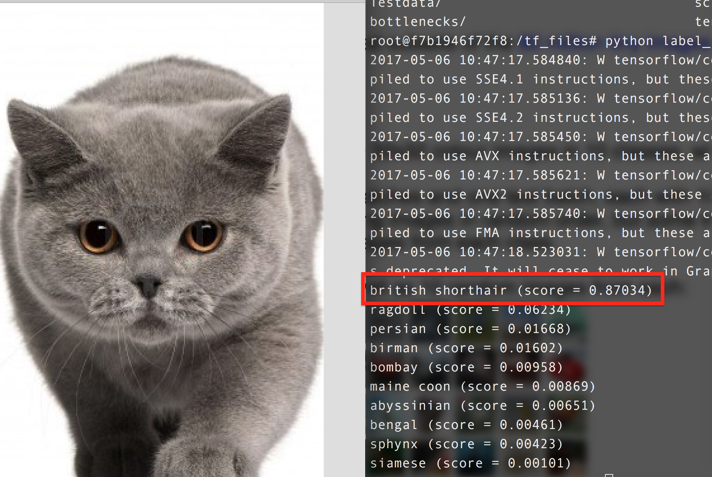

## Introduction   

### Motivation
	  
Image classification problem is the task of assigning an input image one label from a fixed set of categories. This is one of the core problems in Computer Vision that, despite its simplicity, has a large variety of practical applications.
 
Traditional way: Feature Description and Detection. 

Maybe good for some sample task, but the actual situation is far more complicated. 

	
Therefore, instead of trying to specify what every one of the categories of interest look like directly in code, we're going to use machine learning, which is providing the computer with many examples of each class and then develop learning algorithms that look at these examples and learn about the visual appearance of each class. 

However, image classification problem is such a complicated work that always been done with deep learning model like Convolutional Neural Network. We already learnt that many algorithms we studied in class like KNN and SVM usually do a great job on many data mining problems. But it seems that they are sometimes not the best choices for image classification problems. 

So we would like to compare the performance among the algorithms we learnt in class and CNN and Transfer Learning. 

### Objective
	
Our Objective is to: 
	
1. Compare normal algorithms we learnt in class with 2 methods that are usually used in industry on image classification problem, which are CNN and Transfer Learning. 
2. Gain experience on deep learning. 
3. Explore the machine learning framework by Google - TensorFlow. 

## System Design & Implementation details

### Algorithms and Tools

The 5 methods we used in this project are KNN, SVM, BP Neural Network, Convolutional Neural Network and Transfer Learning. 

The whole project is divided into 3 methods. 

- **The first method**: Used **KNN, SVM and BP Neural Network**, which are algorithms we learnt in class. There are powerful and easy to implement. We mainly used **sklearn** to implement those algorithms. 

- **The second method**: While traditional multilayer perceptron (MLP) models were successfully used for image recognition, due to the full connectivity between nodes they suffer from the curse of dimensionality and thus do not scale well to higher resolution images. So in this part we built a **CNN** using deep learning frame work by Google - **TensorFlow**.  

-  **The third method**: Retrained the last layer of a pre-trained deep neural network called **Inception V3**, also provided by **TensorFlow**. 
Inception V3 is trained for the ImageNet Large Visual Recognition Challenge using the data from 2012. This is a standard task in computer vision, where models try to classify entire images into 1000 classes, like "Zebra", "Dalmatian", and "Dishwasher". In order to retrain this pre-trained network, we need to ensure that our own dataset is not already pretrained.

### Implementation

- **The first method:** **Preprocess dataset and apply KNN, SVM and BP Neural Network with sklearn.**

	Firstly, we defined 2 different preprocessing functions using openCV package:The first one is called image to feature vector, to resize the image and then flatten the image into a list of row pixel. The second one is called extract color histogram, to extract a 3D color histogram from the HSV color spacing using cv2.normalize and then flatten the result.
	
	Then, we construct several arguments we need to parse. Because we want to test the accuracy on this part not only for the whole dataset but also the sub-dataset with different number of labels, we construct the dataset as a arguments parsed into our program. And we also construct the number of neighbors used for k-NN method as a parse argument.
	
	After that, we began to extract each image features in the dataset and put them into arrays. We used the cv2.imread to read each image, split the label out by extract the string from the image name. In our dataset, we set the name with the same format: “class label”.”image number”.jpg, so we can easily extract the class label for each image. Then we used those 2 functions we defined before to extract 2 kinds of features and append to the array rawImages and features, and the label we extracted earlier append to the array labels.
	
	The next step is to split the dataset with the function train_test_split, imported from sklearn package. The set with postfix RI,RL is the split result of the rawImages and labels pair, and another is the split result of the features and labels pair. We use 85% of the dataset as train set, and 15% as the test set.
	
	Finally we applied the KNN, SVM and BP Neural Network functions to evaluate the data. For KNN we used KNeighborsClassifier, for SVM we used SVC, and for BP neural network we used MLPClassifier.

- **The second method**:  **Built CNN with TensorFlow**
The entire purpose of TensorFlow is to let you build a computational graph (using any languages like Python) and then execute the graph in C++, which is much more efficiently than if the same calculations were to be performed directly in Python. 

	TensorFlow can also automatically calculate the gradients that are needed to optimize the variables of the graph so as to make the model perform better. This is because the graph is a combination of simple mathematical expressions so the gradient of the entire graph can be calculated using the chain-rule for derivatives.
	
	A TensorFlow graph consists of the following parts which will be detailed below:
	- Placeholder variables used for inputting data to the graph.
	- Variables that are going to be optimized so as to make the convolutional network perform better.
	- The mathematical formulas for the convolutional network.
	- A cost measure that can be used to guide the optimization of the variables.
	- An optimization method which updates the variables.

	A CNN architecture is formed by a stack of distinct layers that transform the input volume into an output volume (e.g. holding the class scores) through a differentiable function. 
	
	
	
	So in our implementation,  the first layer is to hold the images, then we built **3 Convolutional layers** with **2 x 2 max-pooling and Rectified Linear Unit (ReLU)**. 
	The input is a 4-dim tensor with the following dimensions:
	
	- Image number.
	- Y-axis of each image.
	- X-axis of each image.
	- Channels of each image.

	The output is another 4-dim tensor with the following dimensions:
	
	- Image number, same as input.
	- Y-axis of each image. If 2x2 pooling is used, then the height and width of the input images is divided by 2.
	- X-axis of each image. Ditto.
	- Channels produced by the convolutional filters.
	
	
	And then we built **2 Fully-Connected Layers** at the end of the network. 
	The input is a 2-dim tensor of shape [num_images, num_inputs]. The output is a 2-dim tensor of shape [num_images, num_outputs]
	
	However to connect Convolutional layers and Fully-Connected Layers we need a **Flatten Layer** to reduce the 4-dim tensor to 2-dim which can be used as input to the fully-connected layer. 
	
	The very end of CNN is always a **softmax layer** which normalize the output from Fully-connected layer so that each element is limited between 0 and 1 and all the elements sum to 1.
	
	
	To **optimize** the training result we need a cost measure and try to minimize it every iteration. 
	The **Cost function**  we used here is **cross entropy** (called from tf.nn.oftmax_cross_entropy_with_logits()), and take the average of cross-entropy for all the image classifications. 
	The **Optimization Method** is tf.train.AdamOptimizer() which is an advanced form of **Gradient Descent.** The is a parameter **learning rate** which could be adjusted. 
	
- **The third method**: **Retrain Inception V3**
	Modern object recognition models have millions of parameters and can take weeks to fully train. Transfer learning is a technique that shortcuts a lot of this work by taking a fully-trained model for a set of categories like ImageNet, and retrains from the existing weights for new classes. Though it's not as good as a full training run, this is surprisingly effective for many applications, and can be run in as little as thirty minutes on a laptop, without requiring a GPU. 
	For this part of implementation, we followed the instruction here: [link](https://www.tensorflow.org/tutorials/image_retraining). 
	
	First we need to get the pre-trained model, remove the old top layer, and trains a new one on the dataset we have. None of the cat breeds were in the original ImageNet classes the full network was trained on. The magic of transfer learning is that lower layers that have been trained to distinguish between some objects can be reused for many recognition tasks without any alteration.
	Then we analyzes all the images on disk and calculates the bottleneck values for each of them. See details about 'bottleneck' here: [link](https://www.tensorflow.org/tutorials/image_retraining). Because every image is reused multiple times during training and calculating each bottleneck takes a significant amount of time, it speeds things up to cache these bottleneck values on disk so they don't have to be repeatedly recalculated.
	
	The script will run 4,000 training steps. Each step chooses ten images at random from the training set, finds their bottlenecks from the cache, and feeds them into the final layer to get predictions. Those predictions are then compared against the actual labels to update the final layer's weights through the back-propagation process.
	

## Experiments 

### Dataset
The Oxford-IIIT Pet Dataset: [link](http://www.robots.ox.ac.uk/~vgg/data/pets/)

There are 25 breeds of dog and 12 breeds of cat. Each breed has 200 images. 

We only used 10 cat breeds in our project. 

The classes we used here is 
 ['Sphynx','Siamese','Ragdoll','Persian','Maine-Coon','British-shorthair','Bombay','Birman','Bengal','Abyssinian']

So we have totally **2000 images** in our dataset. 
The sizes are different with each other. But we resized them into fixed sizes like 64 x 64 or 128 x 128. 

### Preprocessing

In this project we mainly used OpenCV for precessing the image data like read the image into array and reshape into the size we need. 

A common way of improving the results of image training is by deforming, cropping, or brightening the training inputs in random ways. This has the advantage of expanding the effective size of the training data thanks to all the possible variations of the same images, and tends to help the network learn to cope with all the distortions that will occur in real-life uses of the classifier. 

See links here: [https://github.com/aleju/imgaug](https://github.com/aleju/imgaug). 

### Evaluation
- **The first method:** 
	The first part: Preprocess dataset and apply KNN, SVM and BP Neural Network with sklearn.
	
	In the program, there are many parameters could be adjusted:
In image_to_feature_vector function, we set the size we desired is 128x128, we do have tried other size before like 8x8, 64x64, 256x256. We found that the bigger image size, the better the accuracy. But large image size also increase the execution time and memory it consumed. So we finally decided the image size to be 128x128 because its not too big but can also ensure the accuracy.

	In extract_color_histogram function, we set the number of bins per channel to 32, 32, 32. As the previous function, we tried 8, 8, 8, and 64, 64, 64, and higher number can result to higher result, as well as higher execution time. So we think 32, 32, 32 is appropriate.
	
	For the dataset, we tried 3 kinds of datasets. The first one is the sub-dataset with 400 images, 2 labels. The second one is the sub-dataset with 1000 images, 5 labels. And the last one is the whole dataset with 1997 images, 10 labels. And we parsed the different dataset as arguments in the program.
	
	In **KNeighborsClassifier**, we only changed the number of neighbors and stored the result for the best K for each dataset. All the other parameters we set as default.
	
	In **MLPClassifier**, we set one hidden layer with 50 neurons. We do have tested multiple hidden layers, but it seems has no significant change in the final result. And the maximum iteration time is 1000, with tolerance 1e-4, in order to make sure it converged. And set L2 penalty parameter alpha to default value, random state to 1, solver to ‘sgd’ with learning rate 0.1. 
	
	In **SVC**, maximum iteration time is 1000, and class weight is ‘balanced’.
 
	The **running time** for our program is not very long, it takes about 3 to 5 minutes from 2 labels dataset to 10 labels dataset.
	
- **The second method**:  **Built CNN with TensorFlow**

	It takes a long time to calculate the gradient of the model using the entirety of a large dataset . We therefore only use a small batch of images in each iteration of the optimizer. The batch size is normally 32 or 64. 
	The dataset is divided into training set contains 1600 images, validation set contains 400 images, and test set contains 300 images.  
	
	There are many **parameters** could be adjusted. 
	
	First is the **learning rate**. A good learning rate is easy find as long as it's small enough that could converge and big enough that it won't make the program too slow. 
We chose 1 x 10^-4.
	
	The second is the **size of images** we feed to the network. We tried 64*64 and 128 * 128. It turns out that the bigger images, the better accuracy we could get. However the exchange is running time. 
	
	And then is the **layers and their shapes**. However actually there are too many parameters can be adjusted so it's a very hard work to find the best values for all of them. 
	
	According to many resources from internet, we learnt that the **parameters choosing** for building the network is pretty much rely on **experience**. 
	
	At first we try to built a relatively complicated network. The parameters are showed below:
	
		# Convolutional Layer 1.
		filter_size1 = 5 
		num_filters1 = 64
		
		# Convolutional Layer 2.
		filter_size2 = 5
		num_filters2 = 64
		
		# Convolutional Layer 3.
		filter_size3 = 5
		num_filters3 = 128 
		
		# Fully-connected layer 1.
		fc1_size = 256
		
		# Fully-connected layer 2.
		fc1_size = 256
		
	We used 3 Convolutional Layers and 2 Fully-connected layers, all of them are relatively complicated. 
	
	
	However, the result is -- **Overfitting**. Only after a thousand iteration, our program get 100% training accuracy and only 30 % test accuracy.	
	At first I'm pretty confused about why we got overfitting, and I tried to adjust parameters randomly, and things never getting better. Several days later, I happened to read a article by Google talking about a deep learning project conducted by Chinese researchers. [Link](https://medium.com/@blaisea/physiognomys-new-clothes-f2d4b59fdd6a) .  They pointed out that the research conducted by them is problematic. "**One technical problem is that fewer than 2000 examples are insufficient to train and test a CNN like AlexNet without overfitting**." So I realized that, first our dataset is actually small, second, our network is too complicated. 
	
	**Remember our dataset contains exactly 2000 images**
	
	Then I tried to reduce the number layers and sizes of kernels. I tried many parameters, this is the final structure we used. 
	
		# Convolutional Layer 1.
		filter_size1 = 5 
		num_filters1 = 64
		
		# Convolutional Layer 2.
		filter_size2 = 3
		num_filters2 = 64
		
		# Fully-connected layer 1.
		fc1_size = 128             # Number of neurons in fully-connected layer.
		
		# Fully-connected layer 2.
		fc2_size = 128             # Number of neurons in fully-connected layer.
		
		# Number of color channels for the images: 1 channel for gray-scale.
		num_channels = 3
		
	We only used **2 Convolutional Layers** with small shapes and 2 Fully-connected layers. 
	The result was not that good, we **still get overfitting** after 4000 iterations,  however the **test result was 10% better** than before.
	
	We're still finding a way to deal with it, however the **obvious reason is that our dataset is insufficient**, and we don't have enough time to make more improvement. 
	
	As a result, we roughly **achieved 43% accuracy after 5000 iterations**, and the running time is **over half an hour**. 
	
	**PS**: Actually we feel a little bit upset due to this result, we even didn't gain a sense of how long will a images training process be . So we found another standard dataset called **CIFAR-10**.  [Link](https://www.cs.toronto.edu/~kriz/cifar.html). 
	
	
	The CIFAR-10 dataset consists of 60000 32x32 color images in 10 classes, with 6000 images per class. There are 50000 training images and 10000 test images. 
	
	We used the same network constructed above, after 10 hours training, we got 78 % accuracy on test set. 

- **The third method**: **Retrain Inception V3**
	Same here, we randomly select a few images to train and select another batch a images for validation.  
	
	There are many parameters could be adjusted.
	
	First is **training steps**, the default is 4000, we can try more or try a smaller one if we could get a reasonable result earlier. 
	
	The --**learning rate** controls the magnitude of the updates to the final layer during training. Intuitively if this is smaller then the learning will take longer, but it can end up helping the overall precision. The --**train batch **size controls how many images are examined during one training step, and because the learning rate is applied per batch we'll need to reduce it if you have larger batches to get the same overall effect.
	
	Since for deep learning task, the running time is usually pretty long, we won't hope to know our model is actually bad after hours of training. So we **report validation accuracy frequently**. By this way we can also avoid **overfitting**. The split is putting 80% of the images into the main training set, keeping 10% aside to run as validation frequently during training, and then have a final 10% that are used less often as a testing set to predict the real-world performance of the classifier.

## Result 

- **The first method:** **Preprocess dataset and apply KNN, SVM and BP Neural Network with sklearn.**

	The results are in the following chart. Because the SVM result is very bad, even below the random guessing (1/ # of labels), we did not provide the result of that.

	
	
	From the result we can see: 
	
	- In k-NN, the raw pixel accuracy and histogram accuracy are relatively same. In 5 labels sub-dataset the histogram accuracy is a little bit higher than raw pixel, but over all, the raw pixel shows better result.
	
	- In the neural network MLP classifier, the raw pixel accuracy is much lower than histogram accuracy. For the whole dataset(10 labels), the raw pixel accuracy even lower than random guessing.
	
	- All these 2 sklearn methods do not give very good performance, the accuracy for recognizing the right category is only about 24% in the whole dataset (10 labels dataset).
	These results reveal that using sklearn methods for image recognition are not good enough. They are not able to give good performance for the complex images with many categories. But when comparing to the random guessing, they do have made some improvement, but not enough.

	Based on the results, we found that in order to improve the accuracy, its necessary to use some deep learning method.
	
- **The second method**:  **Built CNN with TensorFlow**
	As we said above, we could not get a good result due to overfitting. 
	
	
	
	It normally takes half an hour to train, however since the result is overfitting, we think this running time is not valuable. 
	After comparing with method 1 we can see that: although the CNN overfits the training data, we still get better result than method 1.  

	
- **The third method**: **Retrain Inception V3**

	
	
	The whole training progress takes no more than 10 mins. And we got extremely good results. We can actually see the power of deep learning and transfer learning. 
	
	Demo: 
	
	 
## Conclusion

Based the comparison above, we can see that: 

- The methods we learnt in class are not enough for some specific task like image classification. 
- Although we got overfitting in CNN part, it's still better than those methods  learnt in class on image classification problem. 
- Transfer Learning is pretty efficient and powerful on image classification problem. It's accurate and fast enough to finish training in a short time without GPU. And it also does a good job to against overfitting even though you have a small dataset. 

We learnt some very important experience for image classification task. This kind of task is pretty different from other tasks we did in class. The dataset is relatively large and not sparse, the network are complicated, so the running time would be pretty long if we don't use GPU. 

- Crop or resize images to make them smaller. 
- Randomly choosing a small batch for training every iteration. 
- Randomly choosing a small batch in validation set for validation, report validation score frequently during training process.
- Try using Image Augmentation to convert a set of input images into a new, much larger set of slightly altered images.
- For image classification task, we need larger dataset than 200 x 10, the CIFAR10 dataset contains 60000 images. 
- More complicated network needs more dataset to train. 
- Be careful of overfitting. 

## References 

1. [CS231n Convolutional Neural Networks for Visual Recognition](http://cs231n.github.io/convolutional-networks/)
2. [TensorFlow Convolutional Neural Networks](https://www.tensorflow.org/tutorials/deep_cnn)
3. [How to Retrain Inception's Final Layer for New Categories](https://www.tensorflow.org/tutorials/image_retraining)
3. [k-NN classifier for image classification](http://www.pyimagesearch.com/2016/08/08/k-nn-classifier-for-image-classification/)
4. [Image Augmentation for Deep Learning With Keras](http://machinelearningmastery.com/image-augmentation-deep-learning-keras/)
5. [Convolutional Neural Network TensorFlow Tutorial](https://github.com/Hvass-Labs/TensorFlow-Tutorials/blob/master/02_Convolutional_Neural_Network.ipynb)

Note: The first method is performed by Ji Tong https://github.com/JI-tong 
